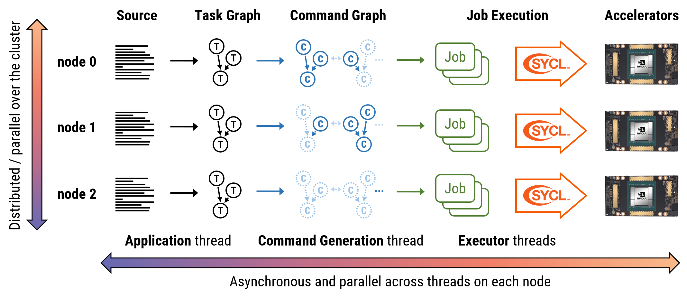

## Celerity Execution Overview

The following diagram illustrates the basics of how programs are executed
internally by the Celerity runtime system:

Everything starts with the user program, which is executed in single program,
multipe data (SPMD) fashion by all MPI ranks. Whenever a relevant Celerity
queue operation -- such as `submit` -- is encountered, the associated _kernel_
code is not executed directly. Instead, this code, together with some dependency 
and scheduling metainformation, is recorded in the Celerity **task graph**.

Concurrently with the user program, a _command generation thread_ constructs a more
detailed **command graph** from existing task graph nodes. This command graph
includes individual instructions for the given node in the system, and also
encodes all necessary data transfers to maintain a consistent view of data
as it would be expected if the program were to be executed on a single node.  
In the Celerity **distributed scheduling** scheme (introduced with Celerity 0.4.0),
only the subset of the command graph necessary for executing locally relevant
commands is created on each node, so e.g. if nodes 0 and 1 communicate with each
other locally, node 2 need not be aware of the related commands.

On each node the jobs encoded withing the command graph are asynchronously
consumed by __executor threads__, which finally leads to actually running the
computations described by each kernel in the input program, distributed among 
the GPUs in the cluster.

In order to make the entire process more clear, this illustration is simplified
in several aspects:

- The details of data allocations, exchange and execution are omitted.
- For this illustration, there are only three nodes in the system.
- In practice, *[Horizons](https://link.springer.com/chapter/10.1007/978-3-031-32316-4_2)*
  constrain the tasks and commands being actively processed by the system into a sliding window.

Despite these simplifications, this illustration captures the basic execution
principle of the Celerity runtime, and hopefully also makes the reasons for
some of the pitfalls described in the [Common Pitfalls](pitfalls.md) section
more clear.
